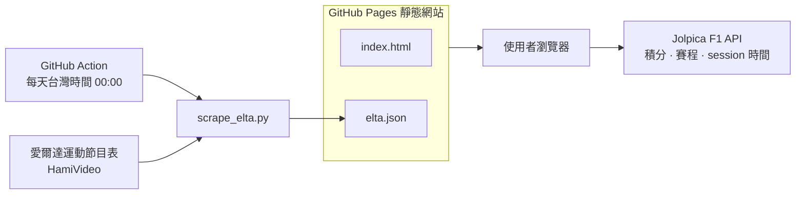

# Formula 1 2026 賽程查詢器(台灣)

網址：https://chinchiehhsiao.github.io/f1_tw

這是一個給台灣 F1 車迷方便查詢的網頁，適用於 HamiVideo 電視運動館方案用戶，整理 2026 賽季的積分、賽程，以及 HamiVideo 愛爾達轉播資訊。專案部署在 GitHub Pages，不需要後端伺服器。

## 架構

## 功能

- **積分榜**：顯示車手積分與車隊積分
- **賽程表**：顯示全年賽程，並換算成台灣時間
- **HamiVideo 愛爾達轉播**：顯示下一站各場次的開播時間、頻道與是否可看
- **問題回報**：可透過 GitHub Issues 回報錯誤或建議

## 資料來源

| 資料 | 來源 | 更新方式 |
|------|------|----------|
| 車手 / 車隊積分 | [Jolpica F1 API](https://api.jolpi.ca/ergast/f1/) | 瀏覽器抓取，快取 1 小時 |
| 賽程 / 場次時間 | [Jolpica F1 API](https://api.jolpi.ca/ergast/f1/) | 瀏覽器抓取，快取 24 小時 |
| 轉播資訊 | [愛爾達運動節目表](https://eltaott.tv/channel/sports_program_detail#F1) | GitHub Action 每天台灣時間 00:00 抓取 |

## 運作方式

### 積分與賽程

網頁開啟時，瀏覽器會直接呼叫 Jolpica F1 API：

- `GET /ergast/f1/2026/driverStandings.json`
- `GET /ergast/f1/2026/constructorStandings.json`
- `GET /ergast/f1/2026.json`

為了減少請求，資料會存在瀏覽器的 `localStorage`：

- 積分：快取 1 小時
- 賽程：快取 24 小時

右上角「重抓 Jolpica 積分、賽程」按鈕可以清除這些快取並重新抓資料。

### 愛爾達轉播

`.github/workflows/scrape.yml` 會每天台灣時間 00:00 執行 `scrape_elta.py`。

流程：

1. 從愛爾達運動節目表抓取 F1 節目資料
2. 選出離抓取當下最近的未來 F1 站別
3. 從同一站內挑選 FP、排位、正賽、衝刺場次
4. 產生 `elta.json`
5. 若資料有變更，GitHub Action 會自動 commit 並 push
6. GitHub Pages 重新部署後，網頁會讀取最新的 `elta.json`

轉播頁會優先顯示 HamiVideo 的開播時間；如果沒有抓到轉播資料，才會顯示 Jolpica 的 session 時間並加註。

## 專案檔案

- `index.html`：主要網頁
- `scrape_elta.py`：抓取愛爾達轉播資訊並輸出 `elta.json`
- `elta.json`：轉播資訊快取資料
- `.github/workflows/scrape.yml`：每天自動更新轉播資訊的 GitHub Action

## 流量監測

使用 [GoatCounter](https://www.goatcounter.com/) 追蹤網站流量，無 Cookie、不追蹤個人身份。

- 追蹤內容：頁面瀏覽次數、訪客來源、瀏覽器、裝置、地區
- 隱私：無 Cookie，不儲存個人資料

## 部署

本專案使用 GitHub Pages 部署。只要 push 到 `main` branch，GitHub Pages 會自動更新網站。

## 聯絡與回報

作者：Chin Chieh Hsiao  
Email：jayabc321@gmail.com  
GitHub repo：https://github.com/ChinChiehHsiao/f1_tw  
問題回報：https://github.com/ChinChiehHsiao/f1_tw/issues

## 狀態

建立時間：2026.05.26  
最後更新：2026.05.27
